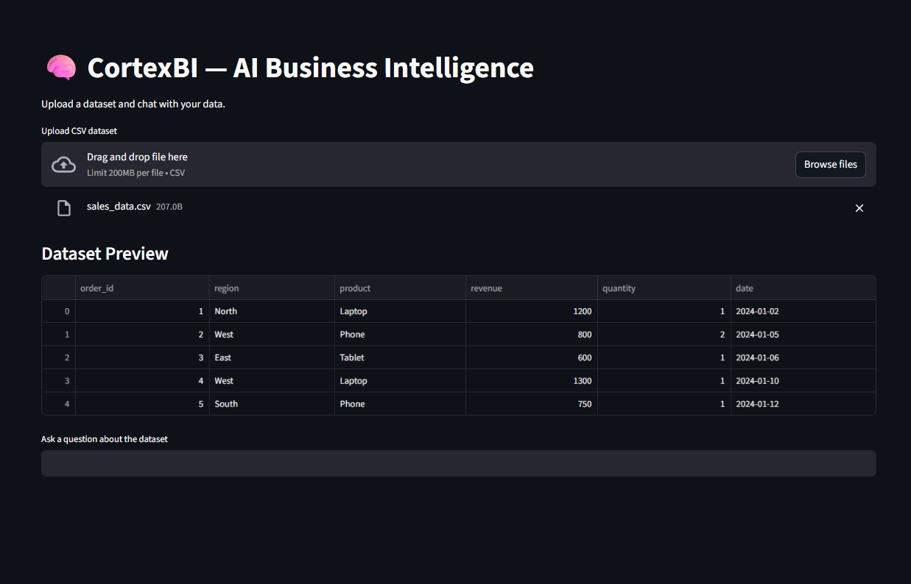
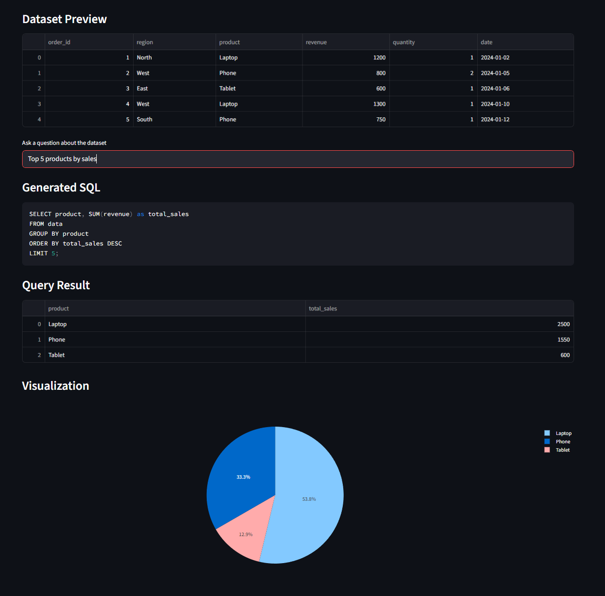
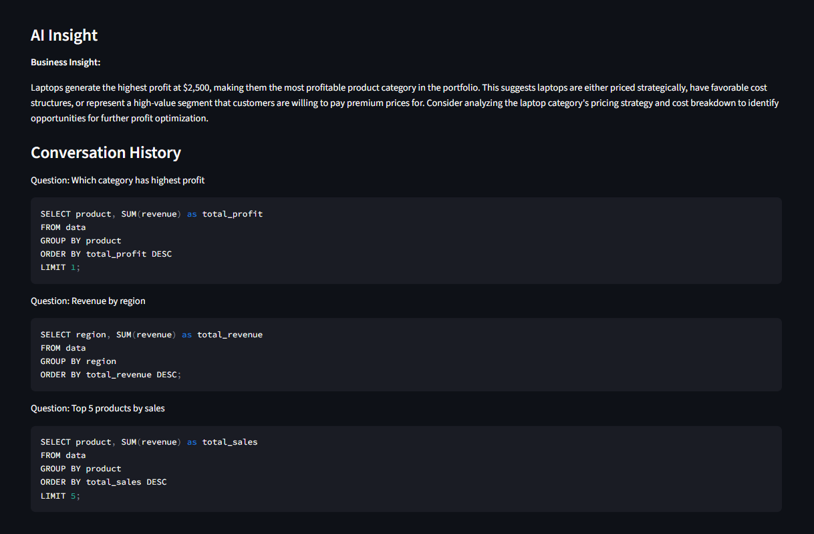

# CortexBI — AI Business Intelligence Assistant

CortexBI is a **local AI-powered business intelligence system** that allows users to upload datasets and analyze them using natural language queries.

The system converts user questions into SQL queries, executes them on a DuckDB analytics engine, and automatically generates visualizations and AI-driven insights.

Everything runs **locally using Ollama LLMs**, ensuring privacy and zero API costs.

---

## Key Features

• Natural language → SQL analytics
• Upload any dataset and analyze instantly
• Automatic visualization generation
• AI-generated business insights
• Conversational memory for follow-up questions
• Runs fully locally with Ollama LLMs

---

## Architecture


Pipeline:

User Question → LLM SQL Generation → DuckDB Query → Visualization → AI Insight

---

## Screenshots

### Dashboard



### Visualization



### AI Insights



---

## Tech Stack

Python
Streamlit
DuckDB
Pandas
Plotly
Ollama (Local LLMs)

---

## Installation

Clone repository:

```
git clone https://github.com/YOUR_USERNAME/cortexBI.git
```

Install dependencies:

```
pip install -r requirements.txt
```

Install Ollama and pull the model:

```
ollama pull qwen3-coder:30b
```

Run the application:

```
streamlit run app/dashboard.py
```

Open browser:

```
http://localhost:8501
```

---

## Example Questions

Revenue by region\n
Top 5 products by sales\n
Monthly revenue trend\n
Which category has highest profit\n

---

## Future Improvements

• multi-dataset joins
• anomaly detection
• scheduled insights

---

## Author

Abhishray Gangwar
Data Analyst | AI Analytics Systems
